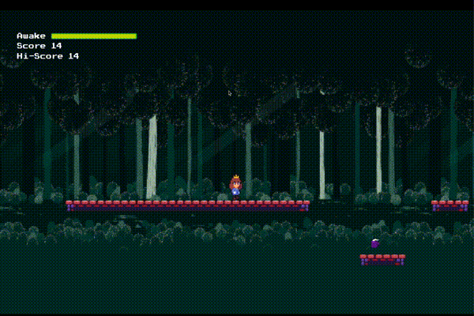

# Sleepy Princess

A half-baked 2d side-scroller written in Godot and C#.

The game basically runs forever and the goal is to reach a high score. A timer starts
counting down but you can replenish it with coffee cups. You jump but the forward momentum
is automatic (so you can't slow down/ back up).

You can double jump and the platforms should be placed randomly each play-through.
(Platforms are actually generated on the fly as you scroll through)

## Building

At the moment, you can't! I used some free assets but need to find the originals and
review their licensing before including it here. Therefore at the moment no assets will be
present.

## Pending Issues

* parallax get a little funky after awhile
* the death sequence stopped working after a godot update
* re-add all the sound/art assets after validating licensing